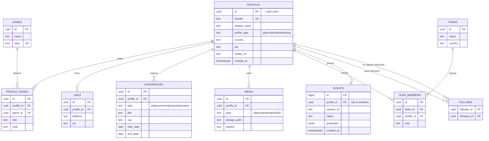

# Arquitectura de LOBBY

Red de identidad profesional gaming para LATAM. Este documento describe la
arquitectura técnica completa de la plataforma: cómo se conectan las piezas,
cómo se modelan los datos, cómo se protege la información y qué se construye en
cada fase.

> **Estado:** documento vivo. El modelo de datos fino (campos por persona) se
> afina cuando se defina la punta de lanza (esports, devs, streamers, etc.). La
> infraestructura descrita acá es independiente de esa decisión.
>
> _Convertido desde `pau/ARQUITECTURA-LOBBY.md.pdf` para tenerlo versionable en
> el repo._

---

## 1. Stack tecnológico

| Capa | Tecnología | Por qué |
| --- | --- | --- |
| Framework / cliente | Next.js (App Router) + TypeScript | SSR para que los perfiles públicos sean indexables por Google (descubribilidad = núcleo del producto) |
| Estilos / UI | Tailwind CSS v4 + shadcn/ui + lucide-react | Componentes reutilizables, consistentes y rápidos de iterar |
| Backend | Supabase | Auth + base de datos + storage en un solo servicio |
| Base de datos | Postgres (gestionado por Supabase) | Datos relacionales (un perfil tiene muchos juegos, torneos, equipo) |
| Seguridad de datos | Row Level Security (RLS) | Reglas de acceso a nivel de base, sin backend propio |
| Archivos | Supabase Storage | Avatares, portfolios, clips |
| Hosting front | Vercel | Deploy automático en cada push a GitHub |
| Sesiones en SSR | `@supabase/ssr` | Sesión en cookies, legible desde el servidor |

---

## 2. Arquitectura general

```
                         Usuario
                            │
                 Cliente Next.js (Vercel)
                            │  supabase-js
        ┌───────────────────┼────────────────────┐
        │                   │                     │
  Supabase Storage    Supabase Auth           Postgres
  (subida/lectura)                        (consultas con RLS)
                                                 │
                            ┌────────────────────┼───────────────────┐
                            │                    │                    │
                   APIs de juegos          PostHog + tabla       Metabase / BI
                   (Riot, Steam)              events            (nivel 3-4)
                    — fase 2                                  Modelos ML — fase 3
                  stats verificadas             eventos
```

El cliente nunca habla con un backend propio: habla directo con Supabase a
través del SDK `supabase-js`, y las reglas de RLS deciden qué puede leer o
escribir cada usuario. Esto elimina la necesidad de mantener un servidor de API
en el MVP.

---

## 3. Estructura del proyecto

```
lobby/
├── app/
│   ├── (auth)/                     # Rutas de autenticación
│   │    ├── login/page.tsx
│   │    ├── registro/page.tsx
│   │    └── auth/callback/route.ts # Cierra el flujo OAuth
│   ├── (public)/                   # Rutas públicas e indexables
│   │    ├── page.tsx               # Landing
│   │    ├── [handle]/page.tsx      # Perfil público (SSR) → lobby.com/german
│   │    └── buscar/page.tsx        # Descubrimiento / búsqueda
│   ├── (app)/                      # Rutas privadas (requieren sesión)
│   │    ├── panel/page.tsx         # Dashboard del usuario
│   │    ├── editar-perfil/page.tsx
│   │    └── onboarding/page.tsx    # Armado inicial del perfil
│   ├── layout.tsx
│   └── globals.css
├── components/
│   ├── ui/                         # Componentes shadcn + gaming-login.tsx
│   └── perfil/                     # Componentes específicos del dominio
├── lib/
│   └── supabase/
│        ├── client.ts              # Cliente para el navegador
│        └── server.ts              # Cliente para Server Components / rutas
├── types/
│   └── database.ts                 # Tipos generados desde el esquema de Supabase
└── middleware.ts                   # Refresca la sesión en cada request
```

---

## 4. Rutas

| Ruta | Visibilidad | Acceso | Descripción |
| --- | --- | --- | --- |
| `/` | Pública | Todos | Landing |
| `/[handle]` | Pública (SSR) | Todos | Perfil público — la pieza indexable |
| `/buscar` | Pública | Todos | Filtros por país, rol, juego, nivel |
| `/login`, `/registro` | Pública | Anónimos | Autenticación |
| `/onboarding` | Privada | Logueados | Completar perfil tras registro |
| `/panel` | Privada | Logueados | Vista del propio usuario |
| `/editar-perfil` | Privada | Dueño | Edición |

La distinción clave: `/[handle]` se renderiza en el servidor para que sea rápido
y aparezca en Google. Las rutas privadas verifican la sesión en el servidor
antes de renderizar.

---

## 5. Autenticación

Tres métodos:

- **Email** — `signUp` / `signInWithPassword`. Con confirmación de email
  activada para reducir cuentas falsas.
- **OAuth** — `signInWithOAuth({ provider })`. Para el MVP: Google y Discord
  (ambos nativos y relevantes para gaming).
- **Steam** — no es nativo en Supabase (usa OpenID 2.0, incompatible con
  OAuth2/OIDC). Requiere un flujo custom en backend. Diferido a fase 2.

### Sesiones en SSR

Al loguearse, Supabase emite un access token (JWT, ~1h) y un refresh token
(larga vida). `supabase-js` renueva el access token solo. En Next.js,
`@supabase/ssr` guarda la sesión en cookies y el `middleware.ts` la refresca en
cada request, de modo que tanto el navegador como el servidor conocen al
usuario.

### Storage (buckets)

| Bucket | Acceso | Contenido |
| --- | --- | --- |
| `avatars` | Lectura pública | Fotos de perfil |
| `media` | Lectura pública | Clips, capturas de portfolio |
| `private` | Solo dueño | Documentos privados (futuro) |

En la base se guarda solo la ruta del archivo, nunca el binario.

---

## 6. Modelo de datos

Diseño en dos niveles: una **tabla núcleo** común a todas las personas, y
**tablas de detalle** que se especializan según el tipo de perfil. Así no hay
que rehacer la base cuando se elija la punta de lanza.

### Diagrama entidad-relación



### Tablas

- **`profiles`** — La identidad base. `handle` único (la URL pública),
  `profile_type` define el tipo (`player`, `dev`, `streamer`, `org`). Se vincula
  1↔1 con `auth.users` de Supabase.
- **`games`** — Catálogo de referencia de juegos (Valorant, LoL, CS, etc.).
  Compartido por todos.
- **`profile_games`** — Qué juega cada uno, en qué rol y con qué nivel. Junction
  entre perfil y juego.
- **`links`** — Enlaces externos (Twitch, Steam, ArtStation, X, itch.io). El
  "media kit vivo".
- **`experiences`** — Historial flexible: estudios donde trabajó, proyectos
  indie, torneos jugados. El campo `type` lo categoriza.
- **`media`** — Portfolio: clips y capturas. Apunta a un archivo en Storage.
- **`teams` / `team_members`** — Equipos de esports y quién los integra. Habilita
  el ángulo "Transfermarkt".
- **`follows`** — Grafo social básico (quién sigue a quién).

### Cómo cada persona reusa el modelo

El `profile_type` y las tablas de detalle hacen el trabajo sin cambiar el
núcleo:

- **Jugador / esports** — usa `profile_games` (rank), `teams`, `experiences`
  (torneos).
- **Dev** — usa `experiences` (estudios/proyectos), `media` (portfolio), `links`
  (itch, ArtStation).
- **Streamer** — usa `links` (plataformas) y, en fase 2, métricas de audiencia
  en una tabla `channel_stats`.
- **Org / marca** — usa `profile_type = 'org'` y, en fase 2, una tabla
  `job_posts`.

---

## 7. Seguridad: Row Level Security (RLS)

Cada tabla tiene políticas que definen acceso a nivel de fila. Patrón general
para `profiles`:

```sql
-- Cualquiera puede ver perfiles (son públicos por diseño)
create policy "perfiles visibles para todos"
    on profiles for select using (true);

-- Solo el dueño puede editar su propio perfil
create policy "el dueño edita su perfil"
    on profiles for update using (auth.uid() = id);

-- Solo el dueño puede insertar su perfil
create policy "el dueño crea su perfil"
    on profiles for insert with check (auth.uid() = id);
```

Las tablas de detalle (`media`, `experiences`, etc.) siguen el mismo principio:
lectura pública, escritura solo del dueño (`auth.uid() = profile_id`). Esto da
seguridad real sin escribir backend.

---

## 8. Búsqueda

- **MVP** — Consultas Postgres con filtros (país, rol, juego, tipo) más búsqueda
  de texto con `pg_trgm` / full-text nativo. Suficiente para los primeros miles
  de perfiles.
- **Después** — Motor de búsqueda dedicado (Typesense o Algolia) cuando el
  volumen y la necesidad de filtros facetados lo justifiquen.

No conviene adelantar el motor de búsqueda: es complejidad que no se necesita
hasta tener masa crítica de perfiles.

---

## 9. Stats verificadas (APIs de juegos) — fase 2

Lo que convierte stats auto-reportadas en stats verificadas — el foso real del
producto:

- **Riot** — rank y estadísticas de LoL / Valorant.
- **Steam** — horas jugadas, logros.
- **Twitch / YouTube** — métricas de audiencia para streamers.

Se ejecutan como tareas en segundo plano (Edge Functions de Supabase o cron) que
sincronizan datos a Postgres periódicamente. No bloquean el lanzamiento: primero
se valida la demanda, después se automatiza la verificación.

---

## 10. Capa de analítica y eventos

Mientras la base relacional (sección 6) guarda lo que el usuario **es** (su
perfil, sus juegos), esta capa captura lo que el usuario **hace**: qué ve, qué
busca, a quién sigue, dónde abandona. Es la materia prima de las métricas, de la
segmentación que se le vende a las marcas y, más adelante, de las
recomendaciones y el perfilado.

> **Regla de oro:** instrumentar esto desde el día uno. Capturar eventos es
> barato al principio y carísimo de reconstruir después — los datos que no
> registraste hoy se pierden para siempre.

### Herramientas

| Herramienta | Para qué | Fase |
| --- | --- | --- |
| Tabla `events` en Postgres | Registro crudo de eventos, propio y bajo tu control | MVP |
| PostHog | Embudos, retención, mapas de calor, eventos de producto. Open source, autohospedable | MVP |
| Metabase | Dashboards y consultas de negocio sobre Postgres. Open source | MVP / Fase 2 |
| Data warehouse (BigQuery / ClickHouse) | Almacén analítico separado cuando el volumen de eventos crece | Fase 2-3 |
| Modelos de ML (Python + tus datos) | Recomendaciones y perfilado | Fase 3 |

**Por qué dos lugares (PostHog y tabla propia):** PostHog te da embudos y
retención sin trabajo. La tabla `events` propia te garantiza que el dato crudo
queda en tu base — clave para después entrenar modelos sin depender de un
proveedor externo.

### Esquema de eventos

```sql
create table events (
    id           bigint generated always as identity primary key,
    profile_id   uuid references profiles(id),  -- null si es anónimo
    session_id   text,
    name         text not null,                 -- p.ej. 'profile_viewed'
    properties   jsonb,                         -- contexto flexible por evento
    created_at   timestamptz default now()
);

create index on events (profile_id, created_at);
create index on events (name, created_at);
```

El campo `jsonb` deja agregar contexto por evento sin migrar la tabla (qué
perfil vieron, qué filtro usaron). Para agregaciones pesadas conviene
materializar vistas (`materialized view`) o mover los eventos a un warehouse en
fase 2.

### Eventos a instrumentar

| Evento | Para qué |
| --- | --- |
| `signup_started` / `signup_completed` | Embudo de registro: dónde se cae la gente |
| `profile_completed` | % de perfiles "vivos" vs vacíos |
| `profile_viewed` | Qué perfiles atraen miradas (el activo que vendés) |
| `search_performed` | Qué buscan reclutadores y marcas (oro para el negocio) |
| `filter_applied` | Qué segmentos tienen demanda real |
| `follow` / `unfollow` | Grafo social y popularidad |
| `media_uploaded` | Engagement y calidad de perfil |
| `external_link_clicked` | A dónde se va el tráfico (Twitch, Steam) |
| `session_start` | Retención y frecuencia de uso |

Usá nombres consistentes (`objeto_acción`, en minúscula) desde el día uno:
renombrar eventos después rompe los históricos.

### Niveles de analítica

- **Nivel 1 — Comportamiento.** Tabla `events` + PostHog. Responde "quién hace
  qué". MVP.
- **Nivel 2 — Negocio.** Agregaciones sobre eventos y perfiles (Metabase): "X
  jugadores de Valorant en AR con tal nivel". Es tu producto para marcas. MVP
  tardío / Fase 2.
- **Nivel 3 — Recomendaciones.** ML sobre el grafo de interacciones: a quién
  seguir, matching talento-estudio, perfiles similares. Necesita escala de
  datos. Fase 3.
- **Nivel 4 — Perfilado psicográfico.** Un pipeline que toma los eventos del
  warehouse, deriva señales (géneros que consume, horarios de actividad,
  afinidades) y arma un vector de perfil por usuario. Fase 3+, y con los
  recaudos de abajo.

---

## 11. Privacidad y cumplimiento

El marco argentino (Ley 25.326, supervisado por la AAIP) avanza hacia estándares
GDPR/LGPD. Conviene diseñar para eso desde el inicio:

- **Consentimiento granular.** Registrá qué aceptó cada usuario y cuándo
  (`consents`: `profile_id`, `purpose`, `granted_at`). El perfilado y la
  segmentación para terceros requieren consentimiento para ese fin específico —
  no alcanza el del registro.
- **Seudonimización.** Para análisis y modelos, trabajá con `profile_id`
  seudonimizado, no con nombre o email. Lo que se le entrega a las marcas: datos
  agregados o con opt-in, nunca personales crudos.
- **Derecho al olvido.** Borrar una cuenta tiene que poder eliminar o anonimizar
  también sus eventos. Resolvelo en el esquema desde ahora (`ON DELETE` o un job
  de anonimización).
- **Transparencia.** Declará en la política de privacidad qué inferís y dale al
  usuario una forma de oponerse al perfilado. En GDPR/LGPD es un derecho; en
  Argentina lo va a ser.

El nivel 4 es el más potente comercialmente y el más riesgoso —legal y
reputacionalmente—. Para una red donde la confianza es el activo, la regla
práctica es: **con consentimiento explícito, datos seudonimizados y
transparencia, o no se hace.**

---

## 12. Recomendaciones y matching escalonado

El sistema de recomendaciones —"a quién seguir", "perfiles parecidos", matching
talento-estudio— no arranca con un modelo entrenado. Se sube por una escalera, y
cada escalón se justifica solo cuando hay datos que lo sostengan. La capa de
eventos (sección 10) es el combustible: sin datos de uso, no hay nada que
aprender.

```
Eventos: señales de uso ──▶ Features: perfil → vector ──▶ Matching: pgvector
        ▲                                                    + ranking
        │                                                        │
        └──────────── el usuario actúa ◀── Recomendaciones ◀─────┘
```

Cada recomendación que el usuario acepta o ignora vuelve como un evento nuevo.
Ese feedback ajusta el modelo: cuantas más vueltas da el ciclo, mejor afina.
Instrumentar eventos desde el día uno es la inversión que habilita todo esto
después.

### La escalera

| Escalón | Cómo | Necesita | Fase |
| --- | --- | --- | --- |
| 1. Reglas | Filtro SQL: mismo juego + país + rol compatible | Nada (día uno) | MVP |
| 2. Similitud por vectores | Cada perfil como vector; buscar los más cercanos con `pgvector` | Perfiles cargados | MVP / Fase 2 |
| 3. Filtrado colaborativo | "Quienes siguieron a X siguieron a Y", sobre el grafo de follows y vistas | Masa de usuarios | Fase 2-3 |
| 4. Ranking aprendido | Modelo entrenado con resultados reales (conexiones, contactos, contrataciones) que reordena para maximizar buenos matches | Volumen de engagement | Fase 3 |

El escalón 1 cubre buena parte del valor inicial con cero datos. No empezar por
el escalón 4: un modelo sin datos no tiene de qué aprender.

### Notas técnicas

- **`pgvector`** viene integrado en Supabase: la búsqueda por similitud
  (escalón 2) corre dentro de Postgres, sin infraestructura de ML separada.
- Los vectores de perfil se arman con features estructuradas (juegos, roles,
  categorías, con pesos) o con embeddings generados por un modelo (OpenAI,
  Cohere u open source) sobre una descripción del perfil. Para arrancar, las
  features estructuradas alcanzan.
- El **ranking aprendido** (escalón 4) corre como un job en Python: lee eventos
  del warehouse, arma features, entrena (puede empezar con regresión logística o
  gradient boosting) y publica las recomendaciones.

**Flujo:** Eventos (Postgres / warehouse) → job de features y entrenamiento
(Python) → recomendaciones servidas (tabla `recommendations` precalculada o Edge
Function de Supabase) → consumidas por el cliente. La similitud vectorial vive en
Postgres vía `pgvector`.

El matching sobre comportamiento (escalones 3-4) cae bajo las reglas de la
sección 11: consentimiento explícito para perfilado y `profile_id` seudonimizado
en el pipeline.

---

## 13. Fases del producto

### MVP

- Auth: email + Google + Discord.
- Perfil base editable con `profile_type`.
- Juegos, links, experiencias, media (portfolio).
- Perfil público indexable en `/[handle]`.
- Búsqueda con filtros básicos.
- Analítica: tracking de eventos (nivel 1) instrumentado desde el inicio.
- Foco en UNA persona (a definir).

### Fase 2

- Login con Steam (flujo custom).
- Stats verificadas vía APIs de juegos.
- Equipos y grafo social completo.
- Motor de búsqueda dedicado.
- Segmentación de audiencia para marcas (nivel 2) + dashboards en Metabase.
- Panel para estudios/marcas + job posts.

### Fase 3

- Segmentación avanzada para marcas/sponsors.
- Recomendaciones y matching talento-estudio (nivel 3).
- Perfilado psicográfico con consentimiento y seudonimización (nivel 4).
- Analítica del ecosistema (el "mapa" de datos).

---

## 14. Infraestructura y deploy

- **Deploy** — Vercel conectado al repo de GitHub. Cada push a `main` publica
  automáticamente. Preview deploys por cada pull request.
- **Backend** — Proyecto gestionado en Supabase (base, auth, storage).
- **Secrets** — Variables de entorno en Vercel y en `.env.local` (nunca en el
  repo): `NEXT_PUBLIC_SUPABASE_URL`, `NEXT_PUBLIC_SUPABASE_ANON_KEY`, y la
  `SERVICE_ROLE_KEY` solo del lado servidor.
- **Tipos** — Generar `types/database.ts` desde el esquema de Supabase para
  tener TypeScript de punta a punta.

---

## 15. Decisiones clave

1. **Next.js con SSR** — porque la descubribilidad de perfiles es el núcleo, no
   un extra.
2. **Supabase** — consolida auth + datos + storage; evita mantener tres
   servicios.
3. **Postgres relacional** — encaja con perfiles ricos y multi-entidad.
4. **RLS** — seguridad sin backend propio.
5. **Foco en una persona para el MVP** — la red gana clavando un caso de uso, no
   cinco.
6. **Steam y stats verificadas a fase 2** — no bloquean el lanzamiento.
7. **Analítica desde el día uno con privacidad por diseño** — los eventos no
   registrados se pierden, y la confianza es el activo de una red de identidad.
8. **Matching escalonado** — reglas y `pgvector` en el MVP; modelos entrenados
   solo cuando haya datos de engagement reales.
